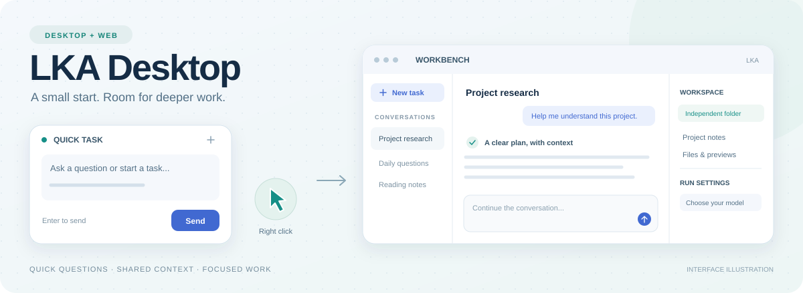

<div align="center">



<h1>理事所 · LKA Desktop</h1>

<p>
在桌宠旁提问，需要时到工作台继续处理。<br>
一个连接 LKA 后端的 Windows 桌面前端，可以聊天、查看资料、管理项目和浏览消息。
</p>

<p>
🪟 Windows 桌宠 &nbsp; · &nbsp; 🌐 浏览器工作台 &nbsp; · &nbsp; 🐍 Python &nbsp; · &nbsp; ☕ Java 21
</p>

<p>
<a href="#capabilities">界面介绍</a> &nbsp; / &nbsp;
<a href="#everyday">日常使用</a> &nbsp; / &nbsp;
<a href="#getting-started">开始使用</a> &nbsp; / &nbsp;
<a href="#qq">QQ 可选接入</a> &nbsp; / &nbsp;
<a href="#development">开发与验证</a> &nbsp; / &nbsp;
<a href="#documentation">阅读文档</a>
</p>

</div>

---

## 快速提问和工作台，两种使用方式

临时想问一句，打开桌宠的快速任务窗口就能开始。
需要读长回复、处理文件或做项目任务时，切换到工作台，查看会话、工作区和运行过程。

**理事所是应用名称，真理是桌宠角色的名称。**
桌宠、快速任务与工作台共享聊天界面和后端会话，可以先简单提问，再接着处理更复杂的任务。

本仓库提供桌面交互、浏览器页面、前端适配服务和可选 QQ 插件。
对话生成、工具执行、记忆、项目与消息分析由独立的
[Local Knowledge Agent OS 后端](https://github.com/Viottery/lka-backend)负责。

<a id="capabilities"></a>

## ✦ 界面里可以做什么

<table>
<tr>
<td width="50%" valign="top">
<h3>🪶 桌宠与快速任务</h3>
<p>右键桌宠，就能打开窗口提问。</p>
<p>Java 桌宠使用 Spine 动画，支持拖动、点击与双击互动。
右键打开快速任务窗口，输入并发送问题，需要时再进入工作台。</p>
</td>
<td width="50%" valign="top">
<h3>🖥️ 大窗口工作台</h3>
<p>在同一个窗口里查看对话、文件和执行过程。</p>
<p>浏览器中查看会话、文件、运行设置与执行过程。
Markdown 回复支持标题、列表、表格、链接和代码块，方便阅读长回复。</p>
</td>
</tr>
<tr>
<td width="50%" valign="top">
<h3>📁 会话与工作区</h3>
<p>每个新会话默认有自己的工作目录。</p>
<p>新会话默认准备独立工作区，也可以切换到已有目录。
打开窗口先进入新任务页；发送第一条消息后再建立会话。
删除的会话进入回收站，可恢复。</p>
</td>
<td width="50%" valign="top">
<h3>🧠 记忆与项目</h3>
<p>查看保存的记忆，管理项目资料和会话。</p>
<p>在页面中查看和管理后端记忆与项目，查看记忆来源，维护项目资料和会话。
模型与运行设置可以手动选择，并保存为后续任务的默认设置。</p>
</td>
</tr>
<tr>
<td width="50%" valign="top">
<h3>💬 消息中心</h3>
<p>查看消息摘要，也可以打开原消息。</p>
<p>接入消息数据后，浏览会话、检索消息、查看话题和重要信息，
打开对应的原消息及前后聊天记录。群名与人物昵称优先使用已有数据，
非文字内容显示类型说明或可用媒体入口。</p>
</td>
<td width="50%" valign="top">
<h3>🔎 运行与操作确认</h3>
<p>查看任务进度，按提示确认具体操作。</p>
<p>查看执行状态和运行记录，在后端要求人工审查时确认具体操作。
Agent 处理任务时，仍可编辑下一条消息；发送按钮会根据运行状态更新。</p>
</td>
</tr>
</table>

<a id="everyday"></a>

## 💬 日常可以这样用

### 先在快速窗口提问，再到工作台继续

右键桌宠，输入一个问题。短任务直接在快速窗口完成；需要继续分析时打开工作台，
沿用同一个会话。**Enter 发送，Shift + Enter 换行。**

### 选择任务的工作目录

开始新任务后，工作区默认放在 Windows 的
`文档/Local Knowledge Agent/Workspaces` 下。
可以在界面中指定默认父目录，或把当前会话切换到已有项目目录。
在工作台里浏览和预览文件，再让后端处理这个目录里的任务。

### 看消息摘要，再打开原文

启用消息接入后，先在消息中心看话题与重要信息，
需要细节时打开来源，阅读对应消息和相邻历史。
摘要和分析由后端更新，前端显示已经处理好的结果。

### 保存常用的模型和设置

从后端读取的模型列表中选择模型，调整运行设置和工作区默认位置。
后续任务使用已保存的选择，需要不同设置时再切换。

<a id="getting-started"></a>

## 🚀 开始使用

**准备环境：** Windows、Python 3.12+；使用桌宠还需要 Java 21。
浏览器模式可先跳过 Java。请先按照
[后端 README](https://github.com/Viottery/lka-backend#readme)
安装、配置模型并启动 LKA 后端。

以下命令在本仓库根目录的 **Windows PowerShell** 中执行。

### 1. 安装前端依赖

```powershell
python -m venv .venv
.\.venv\Scripts\python.exe -m pip install -r requirements.txt
if (-not (Test-Path .env)) { Copy-Item .env.example .env }
```

页面使用原生 HTML、CSS 与 JavaScript，没有单独的前端打包步骤。
Node.js 用于可选浏览器回归测试。

### 2. 连接已运行的后端

后端默认地址为 `http://127.0.0.1:8765`，前端服务默认地址为
`http://127.0.0.1:8780`。先检查后端可访问：

```powershell
Invoke-RestMethod http://127.0.0.1:8765/health
```

**先体验浏览器界面：**

```powershell
.\run-lka-windows.ps1 -NoBackend -NoPet -OpenBrowser
```

浏览器打开聊天页后，可以进入工作台，也可直接访问：

[打开本机工作台](http://127.0.0.1:8780/desktop-pet/chat.html?mode=work&backend=http%3A%2F%2F127.0.0.1%3A8765)

**使用 Java 桌宠：** 安装 Java 21 后，准备环境并编译，再启动。
首次编译需要下载 Gradle 及 Java 依赖。

```powershell
.\scripts\setup-java-env.ps1
.\desktop-pet-java\gradlew.bat -p desktop-pet-java compileJava
.\run-lka-windows.ps1 -NoBackend
```

`-NoBackend` 连接已有后端。后端在 WSL 时，先确认 Windows 能访问其监听地址；
可通过 `-BackendHost`、`-BackendPort` 指定实际地址，通过 `-FrontendPort` 调整前端端口。

<details>
<summary><strong>Windows + WSL：由启动器启动后端</strong></summary>

已在 WSL 安装并配置后端时，可以省略 `-NoBackend`。
启动器默认寻找所选发行版当前用户的 `~/lka_backend`：

```powershell
.\run-lka-windows.ps1 -WslDistro Ubuntu -OpenBrowser
```

其他后端目录用 `-BackendRoot` 指定 WSL 路径。
后端配置和数据库仍由后端项目管理。

</details>

<details>
<summary><strong>全部在 Windows 原生运行</strong></summary>

后端已完成原生 Windows 安装，且包含 `.venv` 与 `scripts/start_backend.py` 时：

```powershell
.\run-lka-native-windows.ps1 -BackendRoot C:\Projects\lka_backend
```

此启动器管理原生后端、前端服务与 Java 桌宠。
仅使用浏览器可添加 `-NoPet -OpenBrowser`。
详细步骤见 [Windows 原生运行说明](docs/windows-native-runtime-guide.md)。

</details>

### 3. 配置与日常操作

| 内容 | 位置或操作 |
| :--- | :--- |
| 前端本机配置 | 从 `.env.example` 创建 `.env`；模型服务配置位于后端 |
| 模型与默认设置 | 工作台的运行设置；可用模型列表由后端提供 |
| 默认工作区父目录 | 界面设置，或本机环境变量 `LKA_SESSION_WORKSPACE_BASE` |
| 当前会话工作目录 | 工作区的“切换”入口，选择已有目录 |
| 已删除会话 | 回收站中恢复；当前未实现超时自动永久删除 |
| 发送与换行 | Enter 发送；Shift + Enter 换行 |
| QQ 插件 | 默认关闭，按下方说明单独配置 |

<a id="qq"></a>

## 🔌 QQ 可选接入

QQ 接入由 **Windows 侧 Python 插件**负责：连接本机 OneBot WebSocket，
将标准化消息写入前端本地 SQLite，再通过鉴权接口同步到 LKA 后端。
后端暂时离线时，待同步消息保留在本机；恢复后幂等补送。
NapCat 断线期间的消息不保证完整补回。

```powershell
.\.venv\Scripts\python.exe -m pip install -r requirements-qq-reader.txt
```

按照 [QQ Reader 接入说明](docs/qq_reader_plugin_delivery_2026-10-02.md)
把 `.env.qq-reader.example` 中需要的设置合并到本机 `.env`。
QQ 宿主组件需另外安装和配置，仓库不包含登录会话或安装组件。

- **采集与发送分别启用。** Reader 只接收事件；发送适配接口支持文字、图片、视频和表情等，需明确开启发送配置。接口说明见 [QQ 消息接口](docs/qq_messaging_interfaces_2026-10-04.md)。
- **Agent 的 QQ 查询工具保持只读。** 前端发送接口的存在不代表 Agent 获得 QQ 发送、撤回或管理权限。
- **凭据留在本机服务。** 浏览器不直接连接 NapCat，也不接触其 Token。Windows 与 WSL 各自管理 SQLite，通过接口同步。

<details>
<summary><strong>数据保存与模型服务</strong></summary>

真实配置、密钥、会话数据、QQ 数据库、媒体缓存与日志不纳入 Git。
Reader 默认不保存完整原始事件；正常页面中的聊天与消息仍可能包含个人内容。

使用远程模型时，对话及选取的上下文会发送给所配置的模型服务。
启用后端消息分析时，相关消息内容也可能进入模型输入；
采集权限与后端分析设置应分别配置。

</details>

<a id="development"></a>

## 🧩 项目结构与验证

| 目录 | 职责 |
| :--- | :--- |
| `app/web/pet/` | 共享聊天界面、工作台、消息中心、样式与静态资源 |
| `desktop-pet-java/` | JavaFX / libGDX 桌宠、原生窗口与消息桥接 |
| `app/plugins/`、`app/api/routes/` | QQ 插件、前端本地服务与后端适配接口 |
| `data/pet/profiles.json` | 随仓库分发的角色、资源和动作定义 |
| `scripts/`、`tests/` | 环境准备、启动辅助、提交检查与回归测试 |
| `docs/` | 接入说明、接口文档和各阶段交付记录 |

当前入口仍引用 `app/agent/`、`app/rag/`、`app/runtime/` 中的兼容模块，
因此保留相关源码和测试。日常 LKA 对话连接独立后端。
个人窗口状态、依赖缓存、运行数据和构建输出保留在本机。

<details>
<summary><strong>开发检查命令</strong></summary>

安装测试依赖后，根据修改的内容选择对应检查。
提交前检查同时覆盖暂存内容和可达 Git 历史：

```powershell
.\.venv\Scripts\python.exe scripts/check-repository.py --staged --history
.\.venv\Scripts\python.exe -m pytest tests/test_qq_reader.py tests/test_qq_actions.py tests/test_message_reading_proxy.py -q
.\desktop-pet-java\gradlew.bat -p desktop-pet-java compileJava verifyPetMotion verifyPetInteraction verifyPetMemoryBridge
```

可选浏览器回归需要 Node.js 与本机 Chrome，使用合成 HTTP 服务：

```powershell
npm ci
npm run test:sessions
npm run test:chat
npm run test:messages
```

其他 Chrome 安装路径用 `CHROME_PATH` 指定。
仓库检查会查找不应提交的运行数据和常见密钥格式，并检查必要资源与 Python 语法；
其范围和历史隐私检查说明见 [仓库交付文档](docs/repository_delivery.md)。

</details>

<a id="documentation"></a>

## 📖 阅读文档

| 想了解什么 | 文档 |
| :--- | :--- |
| Windows 原生环境与启动 | [原生运行说明](docs/windows-native-runtime-guide.md) |
| 桌宠入口与宿主 | [桌宠入口](docs/desktop-pet-entry.md) · [前端说明](docs/windows-pet-frontend.md) |
| UI 与工作台设计 | [界面交付记录](docs/frontend_ui_delivery_2026-09-30.md) |
| 会话、草稿与删除恢复 | [会话交互交付](docs/frontend_session_ux_delivery_2026-10-06.md) |
| 记忆与项目页面 | [记忆适配](docs/frontend_memory_delivery_2026-10-02.md) · [项目适配](docs/frontend_projects_delivery_2026-10-02.md) |
| 消息浏览与原文上下文 | [消息中心交付](docs/frontend_messages_ui_delivery_2026-10-05.md) · [历史消息适配](docs/message_history_frontend.md) |
| QQ 采集与发送接口 | [Reader 插件](docs/qq_reader_plugin_delivery_2026-10-02.md) · [消息接口](docs/qq_messaging_interfaces_2026-10-04.md) |
| 分发范围、资源与隐私检查 | [仓库交付文档](docs/repository_delivery.md) |
| Agent、模型与后端配置 | [LKA Backend](https://github.com/Viottery/lka-backend) |

交付记录保留各阶段的实现与验证情况；当前安装入口以本 README 为准。

## 资源与许可

角色及部分图标源于《明日方舟》相关资源，权益归原权利人所有。
Spine、ArkPets、Pixi、Markdown-it 等第三方组件遵循各自许可，
请同时查看仓库内保留的授权文件与原项目说明。
本仓库没有为所有现有代码和第三方资源统一授予新的开源许可。

---

<div align="center">
<p><strong>理事所</strong> · 在桌宠旁提问，到工作台查看文件和处理任务。</p>
<p><a href="https://github.com/Viottery/lka-backend">LKA Backend</a> &nbsp; · &nbsp; <a href="#getting-started">开始使用</a></p>
</div>
